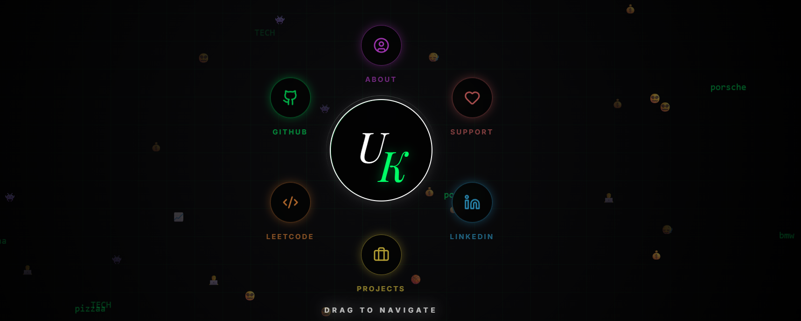

UK's Portfolio 

Welcome to my personal corner of the internet! This isn't just a portfolio; it’s a 12-hour sprint of ideation, rapid prototyping, and deployment, designed to push the boundaries of modern web interactions.

Live Demo on Vercel ---> https://uk-s-portfolio.vercel.app/ 

🛠 The Stack
To achieve a balance of speed and "wow factor," I chose a modern, high-performance stack:

Framework: React + Vite (For lightning-fast HMR)
Styling: Tailwind CSS (Utility-first precision)
Animations: Framer Motion (Silky smooth transitions)
AI Partner: Gemini 3.1 Pro Preview (Code Architecture)
Deployment: Vercel (Edge-optimized delivery)

💡 The Challenge: "The Lag-Free Visual Feast"

The biggest hurdle was the Performance vs. Aesthetics paradox.
How do you pack a site with complex Framer Motion triggers without turning the user's browser into a space heater?
The Solution: I implemented aggressive component lazy-loading and optimized animation triggers to ensure that while the visuals are "heavy," the browser's main thread stays light. The result? 60fps transitions even on modest hardware.

🕹 Features

Custom DNA: Every pixel and hex code was hand-picked to reflect my personal brand.
Gemini-Augmented: Leveraging the latest AI models to refine logic and UI structure.
The Secret Chamber: There is a hidden minigame tucked away somewhere in the code. Can you find the Easter egg? 🥚    [ P.S : its not that hard to find :) ]
